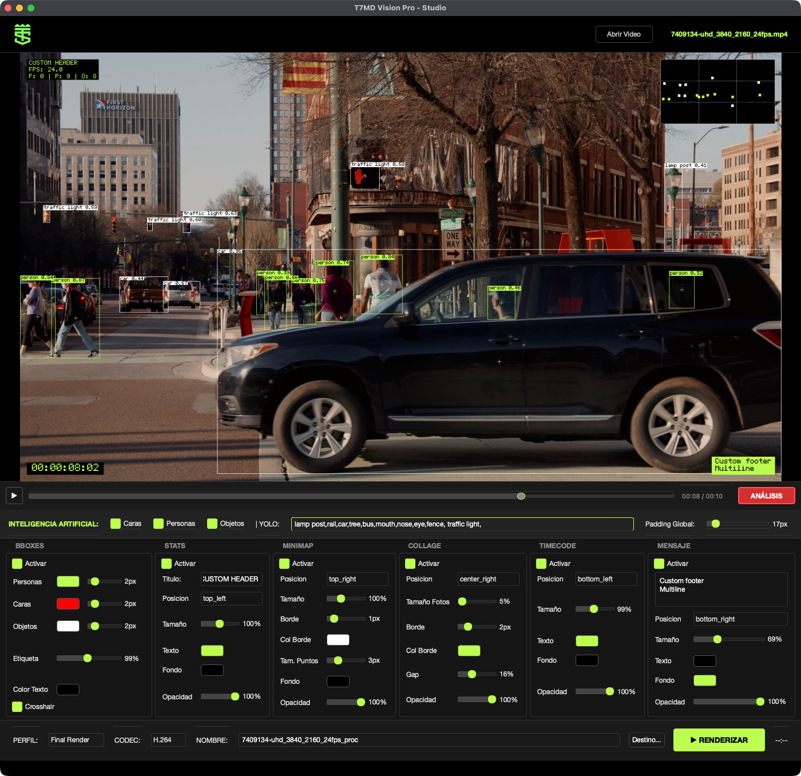

# T7MD 👁️ Motion Detection Software

**Professional Computer Vision & HUD Generation Studio**

T7MD Vision Pro is a high-performance desktop application designed for AI-assisted video analysis and post-production. It leverages state-of-the-art models (**YOLO-World** and **YOLO-Face**) to detect objects, people, and faces, generating customizable futuristic HUDs (Head-Up Displays) and data overlays.


## ✨ Key Features

### 🧠 Advanced AI Engine
* **Dual Detection System:** Runs **YOLO-World** (Open Vocabulary) and **YOLO-Face** (Specialized Face Detection) simultaneously for maximum accuracy.
* **Open Vocabulary:** Detect any object by simply typing its name (e.g., "coffee cup, laptop, cat")—no retraining required.
* **Smart Model Management:** Prioritizes local models to ensure consistency and offline functionality.

### 🎨 Studio UI (V6)
* **Cyber Lime Aesthetic:** Professional dark mode interface with high-contrast accents (`#BCFF4E`).
* **Fluid Dashboard:** Responsive controls for real-time visualization customization.
* **Verbose Terminal:** "Hacker-style" terminal logs with ASCII art and detailed frame-by-frame progress.

### 🎬 Rendering & Export Profiles
* **Final Render:** Exports a `.mp4` video with all graphics baked in.
* **Compositing Mode:** Exports separate image sequences for professional post-production (After Effects/Davinci Resolve):
    * `/seq_bbox`: Only the bounding boxes (transparent PNGs).
    * `/seq_hud`: Only the data overlays and widgets (transparent PNGs).
    * `/crops_faces`: Individual image crops of every detected face.
* **JSON Only:** Exports analysis data without video rendering.



---

## 🚀 Installation

### Prerequisites
* macOS (Silicon/Intel) or Linux.
* Python 3.10 or higher.

### 1. Clone the Repository
~~~bash
git clone https://github.com/dpvmx/T7MD.git
cd T7DM
~~~

### 2. Setup Virtual Environment
It is highly recommended to use a virtual environment to manage dependencies.

~~~bash
# Create environment
python3 -m venv .venv

# Activate environment
source .venv/bin/activate

# Install dependencies
pip install -r requirements.txt
~~~

### 3. Setup Models (Important)
For optimal performance, place your specific model weights in the `models/` directory. The system looks for these exact filenames:

* `models/yolov8m-world.pt` (Medium model for Objects/People)
* `models/yolov8m-face-lindevs.pt` (High-accuracy Face model)

---

## 📖 Usage Guide

You can launch the application using the included script or via terminal.

### Starting the App
**Option A: Quick Launcher (macOS)**
Double-click the `T7MD Vision Pro.command` file.
*(Note: If it doesn't open, run `chmod +x "T7MD Vision Pro.command"` in terminal first).*

**Option B: Terminal**
~~~bash
source .venv/bin/activate
python main.py
~~~

### 🖥️ User Interface Workflow

#### 1. The Header (Import)
* **Load Video:** Click the top-right button to import `.mp4` or `.mov` files.
* **Status:** The filename will appear in green once loaded.

#### 2. The AI Toolbar (Detection Settings)
Located below the video preview.
* **Checkboxes:** Toggle `Faces`, `Persons`, or `Objects` on/off independently.
* **YOLO Input Field:** This is a fluid text box. Type any object names in English, separated by commas.
    * *Example:* `cell phone, backpack, tie`
    * The system will immediately start detecting these items using YOLO-World.
* **Padding:** Adjusts the global safety margin for UI elements.

#### 3. The Dashboard (Visual Customization)
The bottom panel allows you to customize the HUD modules in real-time:

* **BBOXES:** Configure color, thickness, and label size for bounding boxes. The **"Crosshair"** option adds a tactical center target to each detection.
* **STATS:** A floating text panel showing FPS and detection counters. You can move it to any corner (e.g., Top Right, Bottom Left).
* **MINIMAP:** A tactical radar that plots detections relative to the frame center. Useful for "Tech" aesthetic.
* **COLLAGE:** Automatically creates a dynamic stack of cropped faces detected in the current frame.
* **TIMECODE:** Displays the current timestamp and frame count.
* **CUSTOM MSG:** Type any text (e.g., "PROJECT: ALPHA") to display a persistent watermark or label on screen.

#### 4. Export & Rendering
Located at the very bottom.

1.  **Select Profile:**
    * *Final Render:* Good for quick previews or final delivery.
    * *Compositing:* Best for editing. Generates folders with image sequences.
2.  **Select Codec:** H.264 (Standard) or H.265 (High Efficiency).
3.  **Naming:** (Optional) Set a custom output filename.
4.  **RENDER:** Click to start. The terminal will show a detailed progress log:
    > `[RENDER] Frame 00150/02400 (6%) | Detections: Faces=2, Persons=1`

---

## 🔌 Integration with Adobe After Effects (T7MD Bridge)

This tool features a CEP panel for After Effects that allows analyzing video directly from the timeline and automatically generating shape layers (Bounding Boxes).

### 🚀 How It Works
The architecture uses a "Hybrid Bridge" to communicate Adobe ExtendScript with Python:
1.  **After Effects (JS):** Detects the selected video (either in the Project Panel or the Active Layer).
2.  **Launcher (.sh):** An intermediate bash script activates the virtual environment (`.venv`) and prepares the macOS environment variables.
3.  **Python (Headless):** Runs the AI engine in silent mode (`headless.py`), optimized to **skip video rendering** (generating only JSON data for maximum speed).
4.  **Importer (JSX):** AE reads the resulting JSON and draws the vector layers frame by frame.

### 🛠️ Panel Installation
1.  Copy the `T7MD_Panel` folder to:
    * **Mac:** `~/Library/Application Support/Adobe/CEP/extensions/`
    * **Win:** `C:\Program Files (x86)\Common Files\Adobe\CEP\extensions\`
2.  Enable debug mode in terminal:
    ```bash
    defaults write com.adobe.CSXS.15 PlayerDebugMode 1
    ```
3.  Ensure `launcher.sh` has execution permissions:
    ```bash
    chmod +x "/path/to/project/launcher.sh"
    ```

---

## ⚡️ Performance & Hardware Acceleration

**T7MD** is now optimized for Apple Silicon (M1/M2/M3).
* **Mac Users:** The engine automatically detects Metal Performance Shaders (MPS). Expect significantly faster inference times (up to 5x faster than CPU).
* **Windows/Nvidia:** CUDA acceleration remains supported.
* **Fallback:** CPU mode is available if no GPU is detected.

### ⚠️ Current Limitations (v7.3)
* **Detection Mode Only:** Currently, the system performs **Object Detection** (drawing bounding boxes per frame) rather than **Object Tracking** (assigning persistent IDs).
    * *Reason:* Tracking modules (`lap`/`lapx`) are currently disabled on macOS to ensure stability and prevent dependency conflicts.
    * *Impact:* You will see accurate bounding boxes for faces and persons, but no "ID numbers" are currently exported to the JSON.

### 🛠️ Troubleshooting
If you encounter memory issues on Mac, the system includes a failsafe to move tensors from GPU to CPU before rendering (`.detach().cpu()`), ensuring no crashes during the drawing phase.

---

### ✨ New Features
* **Smart Selection:** Automatically detects if you selected a Composition, a Folder, or a valid video file.
* **JSON-Only Mode:** Analysis from AE is 2x faster as it skips MP4 video rendering.
* **Buffer Overflow Fix:** Robust handling of large data volumes (logs) without freezing the Adobe interface.

## ⚠️ Troubleshooting

* **"Model not found":** Ensure your `.pt` files are inside the `models/` folder and named exactly as listed in the installation section.
* **PyTorch Warning:** You might see a warning about `weights_only=True`. The application includes a patch to handle this automatically for YOLO models.

---

**Developed by Damián Paz © 2026**